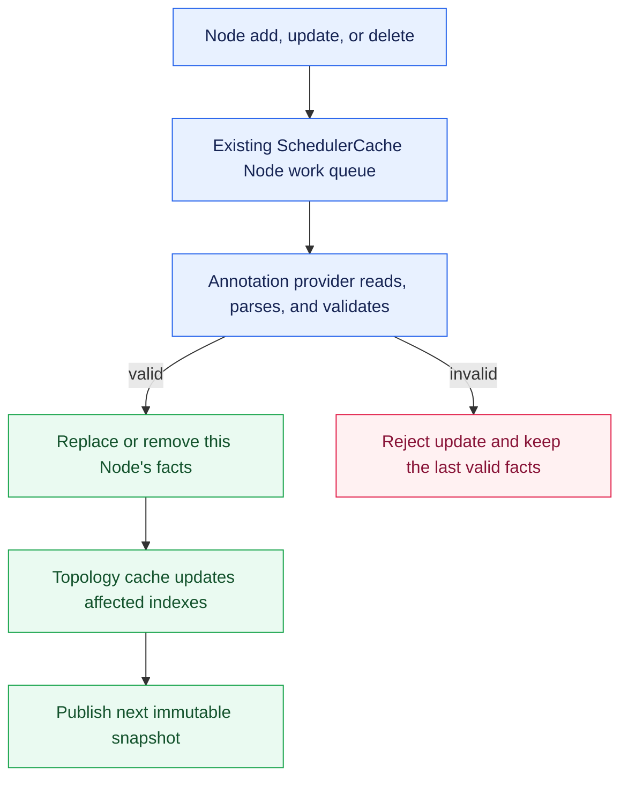
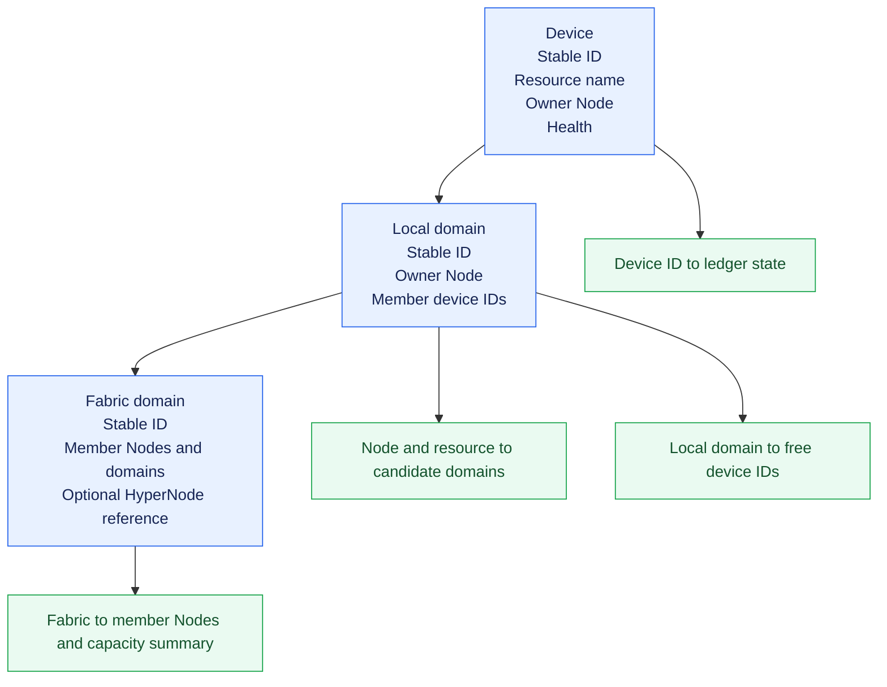
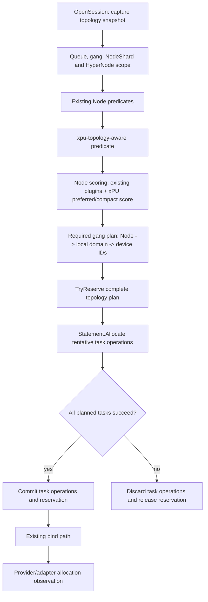
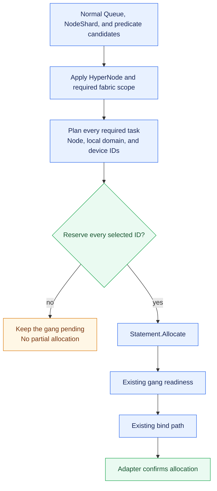
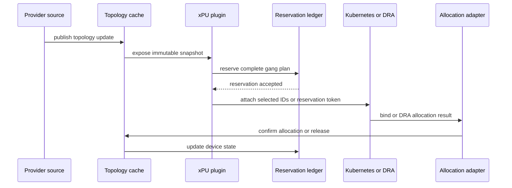

# Generic xPU Topology-Aware Scheduling

**Status:** Proposal

**Feature gate:** `XPUTopologyAwareScheduling` (Alpha, disabled by default)

**Scheduler plugin:** `xpu-topology-aware`

**Target:** Volcano Scheduler

**Related capabilities:** `HyperNode`, `network-topology-aware`, `deviceshare`, and Kubernetes Dynamic Resource Allocation (DRA)

## Abstract

Volcano currently schedules accelerators primarily as aggregate Node resources. That works only when all free devices on a Node are interchangeable. Communication-heavy AI workloads instead depend on the physical interconnect between devices: eight free devices may be unusable for an eight-device Pod when they are split across two independent device domains.

This proposal adds an optional, vendor-neutral xPU topology layer to Volcano. It separates topology discovery, scheduling policy, and runtime allocation enforcement:


The initial implementation is deliberately narrow: full devices, Node-local domains, an annotation or mock provider, and feature-gated behavior. The same model can later support topology CRDs, Device Plugin companions, DRA `ResourceSlice`s, and declared cross-Node fabrics without changing the workload API or scheduling policy.

## Problem

Aggregate accelerator counts do not describe communication topology. Consider a 16-NPU Node with two independent eight-NPU HCCS domains:

```text
Node A
├── domain A0: 6 free NPUs
└── domain A1: 2 free NPUs

aggregate free NPUs: 8
largest connected free domain: 6
```

An eight-NPU Pod that requires one connected domain cannot run on this Node, despite the aggregate resource check succeeding. The same issue occurs with separate NVLink-connected GPU groups, NVSwitch domains, MetaXLink domains, and similar xPU interconnects.

Volcano must also distinguish ordinary multi-Node clusters from rack-scale fabrics:

```text
Ordinary multi-Node cluster              Declared rack-scale xPU fabric
---------------------------              ------------------------------
Node A: local domain                     Node A ─┐
Node B: local domain                             ├─ one physical fabric
Node C: local domain                     Node C ─┘

Network links connect Nodes.             The provider declares a real xPU fabric.
Local domains stay independent.          Pods may share one fabric across Nodes.
```

Free devices on ordinary Nodes must not be treated as one shared xPU domain. A Device Plugin's kubelet-side `GetPreferredAllocation` is insufficient because it runs after Node selection and cannot reject fragmented Nodes, coordinate a PodGroup, or reserve IDs across concurrent scheduling attempts.

## Goals

1. Make physical device domains and availability visible before binding.
2. Support required and preferred local-domain and fabric affinity.
3. Prefer compact allocations that avoid avoidable device fragmentation.
4. Plan and reserve all devices for a gang unit before any Pod in that plan binds.
5. Keep provider parsing independent from scheduling policy and enforcement.
6. Reconcile device health, allocation, reservation, release, and restart state.
7. Preserve existing scheduling behavior when the feature is disabled.
8. Keep the scheduling path indexed and bounded, do not scan all cluster devices for every scheduling attempt.

## Non-goals

The first milestone does not implement vendor discovery, device configuration, NCCL ring construction, MIG/vGPU/fractional-device allocation, xPU-aware preemption, or SubGroup-level xPU policies. It does not replace DRA, Device Plugins, `deviceshare`, HyperNodes, or aggregate Kubernetes resource accounting. It also does not infer topology from device indices, PCI addresses, or aggregate capacity: providers must publish explicit topology facts.

Kubernetes does not provide multi-Pod atomic binding. This design guarantees atomic **planning and reservation before binding**, not rollback of Pods that Kubernetes has already bound successfully.

## Existing Volcano Building Blocks

| Component | Existing responsibility | Role in this design |
| --- | --- | --- |
| `HyperNode` and `network-topology-aware` | Network hierarchy, gradients, and placement scoring. | Provides network locality, does not store per-device state. |
| `NodeInfo.Others` and `SharedDevicePool` | Implementation-specific per-Node device state. | Existing device-share implementations remain independent unless adapted safely. |
| `deviceshare` | Device filtering, scoring, allocation, and release for supported pools. | Is not replaced or double-accounted by the new plugin. |
| `predicates` and upstream DRA plugin | DRA filter, score, reserve, and prebind integration. | Remains the owner of DRA lifecycle and cycle state. |
| `allocate` and `Statement` | Tentative Node/task allocations, gang readiness, commit, and discard. | Hosts the proposed coordinated gang-plan and reservation lifecycle. |

The design builds on `SchedulerCache.Snapshot()`, `Session.AddPredicateFn`, `Session.AddNodeOrderFn`/`AddBatchNodeOrderFn`, the existing `allocate` action, and `Statement` rollback. It does not create a parallel scheduler path.

Existing HAMi Ascend910 selection uses vendor-specific `CustomInfo["NetworkID"]` to group candidate devices and take devices from the largest available local network group first. Its `FilterNode`, score, and allocation paths each run that vendor selection independently. This is a best-effort, Node-local heuristic: it can fall back across groups and does not carry a scheduler-selected plan into allocation. It does not provide a vendor-neutral domain model, a `Required` same-domain guarantee, cross-Node fabric support, exact-ID reservation, or gang-wide planning. The proposed xPU topology feature generalizes that scheduling intent without changing existing HAMi behavior in its alpha scope.

## Proposed Architecture

```mermaid
flowchart LR
    Sources[Trusted topology sources] --> Provider[Provider]
    Provider --> Snapshot[Canonical topology snapshot]
    Snapshot --> Plugin[xPU topology plugin]
    Plugin --> Decisions[Filter, score, and gang plan]
    Decisions --> Ledger[Reservation ledger]
    Ledger --> Adapter[Allocation adapter]
    Adapter --> Runtime[Kubernetes bind or DRA]
    Runtime --> Observe[Allocation and release observation]
    Observe --> Ledger

    classDef source fill:#e8f1ff,stroke:#2563eb,color:#172554
    classDef scheduler fill:#eafaf1,stroke:#16a34a,color:#14532d
    classDef runtime fill:#fff7e6,stroke:#d97706,color:#78350f
    class Sources,Provider source
    class Snapshot,Plugin,Decisions,Ledger scheduler
    class Adapter,Runtime,Observe runtime
```



### Provider Lifecycle and Source Boundary

Providers are responsible only for consuming topology facts. They do not discover hardware, configure devices, or invent a topology from aggregate Node capacity. The component that owns the hardware inventory (an administrator, vendor operator, Device Plugin companion, or DRA driver) publishes facts, the provider validates and forwards them.

The alpha implementation has two providers:

| Provider | Purpose | Data path |
| --- | --- | --- |
| Node annotation provider | Production-shaped initial integration. | Kubernetes Node informer -> annotation parser -> validated provider update. |
| Mock provider | Unit, integration, and KWOK topology scenarios. | Test fixture -> validated provider update. |

Topology CRD, Device Plugin companion, vendor API, and DRA `ResourceSlice` providers are explicitly deferred. They must implement the same provider contract, not add source-specific branches to the scheduler plugin.

The annotation provider reuses the scheduler cache's existing Node informer. It does not create a second Node watch. A Node add, update, or delete is already queued by `SchedulerCache`, while the cache synchronizes that Node, the provider reads the configured annotation, parses it, and submits a replace-or-delete update for that Node. Parsing occurs in the cache work path rather than the informer callback so a large or invalid annotation cannot delay event delivery.

Provider readiness is separate from ordinary Node readiness. The topology cache starts from an empty, explicitly not-ready source state, accepts only a fully validated initial provider sync, and then publishes topology revisions. A `Required` request must remain pending with `XPUTopologyDataNotReady` until its configured provider has completed initial sync for the relevant Node or fabric. It must never be admitted merely because the Kubernetes Node object arrived before the provider or its configuration was ready. Provider initialization must not depend on legacy DeviceShare feature flags or the order in which `NodeInfo` happened to be constructed.



The annotation schema is versioned and source-owned. The initial schema contains a source generation and timestamp, device records, local-domain membership, optional fabric membership, and health. Every device record must identify its resource name, owning Node, stable device ID, and local-domain ID. Every domain must have a stable ID and a unique member list. A fabric has a stable ID and names its member Nodes or local domains. The provider rejects duplicate IDs, a device owned by the wrong Node, unknown domain members, or a device/domain that moves without an explicit source generation change.

For example, a source-specific NVIDIA annotation and an HCCS annotation may use different field names, but both must yield the same provider update: devices with an owner Node and resource name, plus a local domain containing those device IDs. Terms such as `NVLink` and `HCCS` are optional attributes for observability, they are not scheduler control flow.

#### Initial Node Annotation Contract

The annotation provider is the only production-shaped source in the alpha scope. The annotation is an inventory contract for a trusted cluster component, workload users must not be allowed to write it. A representative payload is:

```yaml
metadata:
  annotations:
    topology.volcano.sh/xpu-inventory: |
      {
        "apiVersion": "topology.volcano.sh/v1alpha1",
        "generation": "node-a-42",
        "observedAt": "2026-08-04T12:00:00Z",
        "devices": [
          {
            "id": "nvidia://GPU-4c2e",
            "resourceName": "nvidia.com/gpu",
            "localDomain": "node-a/nvlink-0",
            "health": "Healthy"
          }
        ],
        "localDomains": [
          {
            "id": "node-a/nvlink-0",
            "devices": ["nvidia://GPU-4c2e"]
          }
        ],
        "fabrics": []
      }
```

For a declared cross-Node fabric, the provider includes the participating Nodes and their local domains. For example, the annotation source for `node-a` can publish its membership in a fabric that also contains facts published for `node-b`:

```json
"fabrics": [
  {
    "id": "rack-1/nvlink-fabric-0",
    "nodes": ["node-a", "node-b"],
    "localDomains": ["node-a/nvlink-0", "node-b/nvlink-0"],
    "interconnect": "NVLink"
  }
]
```

The cache accepts the fabric only when every referenced Node and local domain is present in the current provider facts. A normal multi-Node cluster must not publish a fabric merely because its Nodes communicate over Ethernet, InfiniBand, or RoCE.

In the common multi-Node case, each Node publishes only its own local device domains and leaves `fabrics` empty. The Nodes may still be network-connected through an existing HyperNode/rack definition, but that network relationship is not an accelerator fabric:

```text
HyperNode rack-1 (existing network topology)
├── node-a: local domain node-a/nvlink-0
├── node-b: local domain node-b/nvlink-0
└── network: RoCE or InfiniBand

xPU topology facts
├── node-a annotation: fabrics: []
└── node-b annotation: fabrics: []
```

For example, a four-GPU Pod can receive a valid local NVLink group on `node-a` and another Pod can receive a valid local group on `node-b`. The scheduler must not treat those eight GPUs as one same-domain or same-fabric allocation merely because the Nodes can communicate through RoCE or InfiniBand. Network-topology-aware scheduling can still choose an appropriate rack or HyperNode for the PodGroup.

The surrounding Node object supplies the owner Node name, so a device cannot claim a different Node. The provider treats one accepted annotation as the complete topology fact set for that Node and source generation. Removing the annotation removes that source's Node facts, it does not immediately free an allocated device until the availability ledger reconciles an authoritative release.

The provider reports structured errors for malformed JSON, an unsupported schema version, duplicate identities, unknown domain membership, stale generation, or a payload larger than the configured limit. It must never partially apply an invalid Node update.

### Canonical Topology Model

The scheduler stores source-normalized facts separately from scheduling state:

```text
Topology facts:       device IDs, Node ownership, local domains, fabrics, provider-reported health
Availability ledger:  observed allocation, reservation, release, unavailable/tombstone state
Session view:         immutable indexed snapshot at one topology revision
```

The core objects are:



```go
type TopologyDevice struct {
    ID            DeviceID
    ResourceName  corev1.ResourceName
    NodeName      string
    LocalDomainID DeviceDomainID
    FabricIDs     []FabricDomainID
    Health        DeviceHealth
}

type DeviceDomain struct {
    ID           DeviceDomainID
    NodeName     string
    ResourceName corev1.ResourceName
    DeviceIDs    []DeviceID
}

type FabricDomain struct {
    ID                 FabricDomainID
    NodeNames          []string
    LocalDomainIDs     []DeviceDomainID
    HyperNodeReference string // optional network-topology anchor
}
```

Device, domain, and fabric IDs must be stable across provider updates and scheduler restarts. A device ID must not be a transient list index. Contradictory updates (for example, one ID assigned to two Nodes) are rejected rather than merged.

The cache maintains indexes for `resource + Node -> local domains`, `resource + domain -> free device IDs`, `fabric -> member Nodes and capacity summary`, and `device ID -> ledger state`. Detailed devices remain outside the `HyperNode` CRD, fabrics may reference a HyperNode only for candidate intersection and observability.

### Topology Cache and Session Snapshot

The topology cache is scheduler-owned, session-independent state. It has two layers:

```text
provider facts                    scheduler-owned availability ledger
--------------                    -----------------------------------
device/domain/fabric identity     observed allocation
source generation and age         active reservation
Node ownership and membership     releasing/unavailable/tombstone state
provider-reported health          reconciliation generation
```

Provider updates replace only the facts owned by that source and affected Node or fabric. They cannot overwrite allocations or reservations. A provider-reported health change is a topology-fact update and therefore publishes a new immutable `TopologySnapshot`, the availability ledger mirrors it by treating the device as unavailable. The cache validates the combined result, updates only affected indexes, increments the topology revision, and never mutates a snapshot that is already visible to a scheduling session.

At `OpenSession`, the scheduler captures one snapshot revision. Predicate and score callbacks use that revision for their entire scheduling session, while reservation operations revalidate selected IDs against the live ledger before succeeding. This gives stable planning input without allowing two sessions to reserve the same device.

The scheduler cache exposes operations conceptually equivalent to:

```go
Snapshot() *TopologySnapshot
ApplyProviderUpdate(update ProviderUpdate) error
TryReserve(plan TopologyPlacementPlan) (Reservation, error)
CommitReservation(reservationID ReservationID) error
ReleaseReservation(reservationID ReservationID)
ReconcileAllocation(observation AllocationObservation) error
```

These are cache-internal interfaces, not a new user-facing API. `TryReserve` checks that all IDs are healthy, free, current, and part of the planned domain/fabric, it either reserves the entire plan or changes nothing.

### Availability and Aggregate Resource Safety

For strict full-device scheduling, available device capacity is:

```text
healthy published capacity
  - observed allocations
  - active reservations
  - releasing devices
  - unknown or unhealthy devices
```

`Releasing` devices are not free in the first implementation. If a device disappears while allocated, it remains an unavailable tombstone until authoritative reconciliation confirms release.

Topology augments, but never replaces, normal resource accounting:

```text
eligible task-node pair = normal Kubernetes/Volcano resource fit
                          AND topology-domain/device fit
```

`Statement.Allocate` remains responsible for normal `NodeInfo` resource accounting. The topology ledger reserves device identity only, it must not subtract the same extended resource from `NodeInfo` a second time. For extended-resource providers, published whole-device capacity may not exceed matching Node allocatable capacity. DRA providers perform the equivalent consistency check using ResourceSlice/claim semantics. A disagreement blocks Required scheduling and removes topology preference for Preferred scheduling until reconciliation succeeds.

xPU request resolution uses Volcano's Kubernetes-compatible effective Pod request, not a device backend's private container loop. It therefore includes regular containers that run together, restartable init sidecars that continue running with them, the maximum sequential-init phase, and Pod overhead. The full-device alpha accepts only an integral whole-device request for the selected extended resource. Provider fields describing shared memory, cores, virtual-device count, MIG, or other vendor geometry must not be silently converted into a whole-device record.

## Workload Policy

The user-facing API for a Volcano Job is a source-independent `spec.xpuTopology` policy. The Job controller copies it to the generated `PodGroup.spec.xpuTopology`, following the existing `Job.spec.networkTopology` flow. The scheduler reads the PodGroup form as its canonical policy. This also lets users who create Pods and a PodGroup directly set the same policy without creating a Volcano Job.

The alpha policy applies uniformly to the PodGroup scheduling unit. Different task-group xPU policies are deferred because they require explicit inheritance and conflict semantics with the PodGroup rule. Exact API names and versions require API review, the following Job YAML is illustrative:

```yaml
apiVersion: batch.volcano.sh/v1alpha1
kind: Job
metadata:
  name: local-domain-training
spec:
  xpuTopology:
    resources:
    - resource:
        extendedResourceName: nvidia.com/gpu
      deviceDomainAffinity: Required
      allocationStrategy: Compact
  minAvailable: 1
  tasks:
  - name: worker
    replicas: 1
    template:
      spec:
        containers:
        - name: trainer
          image: example/trainer:latest
          resources:
            requests:
              nvidia.com/gpu: 8
```

The corresponding PodGroup policy applies to the generated worker Pod. It is eligible only if one local domain has eight healthy, free, enforceable devices.

For a DRA request, `resource.claimName` identifies the matching entry in each Pod's `spec.resourceClaims`:

```yaml
spec:
  xpuTopology:
    resources:
    - resource:
        claimName: accelerator
      deviceDomainAffinity: Preferred
    fabric:
      affinity: Preferred
```

Because the policy is group-level but claims are per-Pod, every Pod in the alpha PodGroup scheduling unit must contain the declared claim alias for a claim-based requirement. The scheduler reports a specific claim-resolution error when the alias is absent.

Defaults are conservative: omitted local-domain affinity means no same-domain constraint, omitted fabric means no fabric constraint and omitted compact strategy adds no xPU-specific packing preference. Workloads never name device, domain, fabric, or vendor identifiers.

The webhook validates feature-gate use, one resource selector per requirement, and recognized values. It cannot prove that a runtime adapter can enforce selected IDs, the scheduler rejects a Required request with an explicit reason when no compatible adapter is active.

### Proposed API Types and Semantics

`xpuTopology` is one optional field on `JobSpec` and its scheduler-canonical `PodGroupSpec` equivalent. It does not replace existing `networkTopology`, `subGroupPolicy`, Pod `affinity`, or Pod `topologySpreadConstraints`. Those fields continue to express network placement, group membership, and ordinary Kubernetes Pod placement. `xpuTopology` expresses only accelerator-domain intent.

The names below are proposed for API review. They make the ownership and validation surface concrete. The alpha implementation must not expose a different implicit annotation API for workload intent.

```go
type XPUTopologySpec struct {
    Resources []XPUResourceTopologyRequirement `json:"resources,omitempty"`
    Fabric    *XPUFabricAffinity               `json:"fabric,omitempty"`
}

type XPUResourceTopologyRequirement struct {
    Resource                 XPUResourceSelector        `json:"resource"`
    DeviceDomainAffinity     TopologyAffinityMode       `json:"deviceDomainAffinity,omitempty"`
    AllocationStrategy       XPUAllocationStrategy      `json:"allocationStrategy,omitempty"`
}

type XPUResourceSelector struct {
    ExtendedResourceName corev1.ResourceName `json:"extendedResourceName,omitempty"`
    ClaimName            string              `json:"claimName,omitempty"`
}

type XPUFabricAffinity struct {
    Affinity TopologyAffinityMode `json:"affinity,omitempty"`
}
```

For one requirement, exactly one selector is set:

- `extendedResourceName` identifies a full-device Kubernetes extended resource, such as `nvidia.com/gpu`.
- `claimName` identifies the Pod `resourceClaims` alias for a DRA-backed workload.

`DeviceDomainAffinity` and fabric `Affinity` accept `Required` or `Preferred`. `Required` is a hard filter and requires an allocation adapter that can enforce the selected device IDs: no matching healthy, enforceable topology means no placement. `Preferred` is a score only: a normal placement remains valid if no matching domain or exact-ID enforcement is available. `AllocationStrategy` initially accepts `Compact` or an omitted value. `Compact` is a preference, never a hard constraint.

All requirements on a Task are ANDed. For example, a Task requiring a same-domain GPU group and a Required fabric must satisfy both rules. A PodGroup with no `xpuTopology` field receives no topology-specific filter, score, plan, or reservation and follows the existing scheduler behavior.

### Admission Webhook Validation

The webhook makes invalid intent fail at admission instead of becoming an ambiguous runtime placement failure:

1. Reject a non-empty `xpuTopology` policy unless `XPUTopologyAwareScheduling` is enabled.
2. Require at least one resource requirement and exactly one of `extendedResourceName` or `claimName` in each requirement.
3. Require a valid extended resource name. Reject CPU and memory because the first scope is full accelerator devices, not CPU/NUMA topology.
4. Accept only `Required` or `Preferred` affinity and `Compact` as the initial allocation strategy.
5. Reject duplicate requirements targeting the same resource selector in one policy.
6. For a DRA selector, validate only that the alias is syntactically valid. The scheduler resolves the alias against each Task Pod at runtime and reports `XPUClaimNotFound` when it is absent.

The webhook does not validate live topology, device availability, source freshness, or adapter enforcement. Those facts are dynamic and remain scheduler responsibilities.

## Providers and Allocation Adapters

Providers normalize data, adapters determine what the scheduler can safely promise. They are intentionally separate.

| Integration | Provider responsibility | Enforcement level |
| --- | --- | --- |
| Node annotation / mock | Publish local devices, domains, fabric membership, and health. | Mock adapter: exact. Annotation alone: observation only. |
| Topology CRD | Publish cluster-managed topology facts. | Depends on its paired adapter. |
| Device Plugin companion | Publish stable inventory, health, and allocation records. | Exact only when the companion accepts a trusted scheduler selection, otherwise Preferred only. |
| DRA `ResourceSlice` | Map driver-published device attributes/capacity to canonical domains. | Exact only if the DRA driver exposes a documented way to honor the selection. |
| Vendor API | Publish vendor-management topology. | Depends on a separate compatible allocation adapter. |

An accepted provider update includes a source generation, timestamp, stable objects, and optional freshness deadline. The provider validates schema size, Node ownership, unique IDs, domain membership, fabric references, and source generation. The cache does not merge contradictory device facts from multiple authorities. Stale data makes devices unavailable for Required requests and removes the topology bonus for Preferred requests.

Plain Device Plugins and kubelet `GetPreferredAllocation` are not a reservation or exact-enforcement interface. Likewise, the xPU plugin must not instantiate a second upstream `DynamicResources` plugin: predicates remains responsible for DRA prefilter, filter, score, reserve, and prebind behavior.

### Allocation Adapter Contract

An allocation adapter is the boundary between a scheduler placement plan and the component that actually assigns devices to a container. It must declare whether it supports exact enforcement, pre-bind reservation, and authoritative allocation and release observation. The plugin enables a `Required` topology rule only when an adapter reports the capabilities needed to enforce that rule.

The following interface is illustrative, its final package and exact supporting types require framework and API review:

```go
type AllocationAdapter interface {
	Capabilities() AdapterCapabilities
	Reserve(ctx context.Context, plan TopologyPlacementPlan) (Reservation, error)
	Confirm(ctx context.Context, reservation Reservation) (AllocationObservation, error)
	Release(ctx context.Context, reservation Reservation) error
}
```

For every proposed placement, the adapter receives the Task or Pod identity, selected Node, local-domain ID, fabric ID when applicable, and concrete device IDs. Its contract is:

1. **Validate and reserve:** accept every selected ID for the plan or reject the request without partially reserving it. Reservations must prevent a concurrent allocation from receiving the same ID.
2. **Confirm enforcement:** after the normal bind/DRA path, report whether the real allocator assigned the selected IDs to the intended Pod. A successful Node bind alone is not proof of exact device assignment.
3. **Release and reconcile:** release unconfirmed reservations after discard, bind, prebind, or enforcement failure. Publish authoritative allocation, release, and health changes so the topology cache can converge.
4. **Report a structured failure:** distinguish unsupported exact selection, contention, stale inventory, and allocator failure so the scheduler can retry or expose a useful unschedulable reason.

The adapter also owns an immutable selected-ID handoff into the existing bind path. A filter or scoring calculation may discover candidate IDs, but exact allocation must consume the IDs recorded in the accepted plan or reservation token. It must not rerun a vendor chooser and silently select a different set during `Allocate`. The handoff must be idempotent across bind retries and identify the intended Pod/container request unambiguously. Existing DeviceShare implementations demonstrate annotation carry through the predicate allocation event, but those annotations are not by themselves a generic transactional enforcement protocol.

For `Required`, the adapter must validate and enforce the exact selected IDs. If no such adapter is active, the scheduler rejects the placement rather than presenting a best-effort result as a guarantee. For `Preferred`, the plugin may use an observation-only adapter: it can score a topology-valid Node or domain, but it must not claim that the final allocator will choose the planned IDs.

### Resource Ownership and DeviceShare Coexistence

Each accelerator resource must have exactly one exact-allocation owner for a scheduling cycle. The xPU plugin and an existing `deviceshare` backend must not independently reserve, release, or subtract the same physical device IDs, because either path could select a device that the other path has already committed.

| Workload and integration | xPU behavior | Allocation owner |
| --- | --- | --- |
| No `xpuTopology` policy | Does not filter, score, plan, or reserve topology IDs. | Existing `deviceshare`, DRA, or Kubernetes allocation path. |
| `Preferred` policy with legacy `deviceshare` only | May use current topology facts for a score but creates no exact-ID reservation and makes no exact-ID guarantee. | Existing `deviceshare` backend. |
| `Required` policy with legacy `deviceshare` only | Rejects the placement with `XPUAssignmentNotEnforceable`. | None, a best-effort result must not be presented as Required. |
| `Required` policy with a compatible adapter | Plans and reserves exact IDs, then requires adapter confirmation. | The configured xPU allocation adapter. |

At plugin initialization, the scheduler validates a single resource-ownership map from resource name to the configured exact-allocation owner. A `Required` xPU request is enabled only when that owner advertises stable identities, atomic reservation, exact-ID enforcement, and authoritative reconciliation. An adapter may consume an existing `SharedDevicePool` or backend as an implementation detail only after proving that it shares the same reservation lifecycle and cannot double-account resources.

The first alpha implementation does not make legacy `deviceshare` backends implicit xPU adapters. A future HAMi, NVIDIA, or other DeviceShare adapter must explicitly accept the scheduler-selected IDs or reservation token, prevent the backend from independently choosing conflicting IDs, and reconcile allocation and release through the same ownership path.

## Scheduling and Gang Reservation

### Per-Task Filter and Score

At session open, the plugin captures an immutable topology snapshot. It uses existing session extension points as follows:

| Phase | Integration | Effect |
| --- | --- | --- |
| Filter | `Session.AddPredicateFn` | Rejects a Node when Required local-domain/fabric, freshness, health, or enforcement conditions fail. |
| Score | `Session.AddNodeOrderFn` or `AddBatchNodeOrderFn` | Adds Preferred-affinity and compact-placement scores after normal eligibility. |
| Gang plan | New framework-owned `GangPlan` hook in `allocate`. | Selects all Nodes/domains/IDs and reserves them together before `Statement.Allocate`. |
| Commit/Discard | `Statement` transaction participant. | Keeps or rolls back topology reservations with the existing tentative allocation. |

For `Compact`, the plugin prefers an exact domain fit, then the smallest domain that fits, before applying existing Node and HyperNode scores. Compact is never a hard constraint by itself.

### Plugin Responsibilities and Boundaries

`xpu-topology-aware` is an optional scheduler plugin. It adds topology eligibility, topology preference, and coordinated reservations. It does not replace normal Kubernetes resource fit or device allocation systems.

| Scheduler stage | Plugin responsibility | Existing owner that remains authoritative |
| --- | --- | --- |
| Request preparation | Resolve the PodGroup policy and its Pod resource or claim selector. | Webhook validates the policy, predicates resolves standard Pod feasibility. |
| Predicate | Check that a candidate Node has a current, healthy, enforceable local domain and, when required, belongs to the selected fabric. | `predicates` and normal Node resource accounting. |
| Node ordering | Prefer matching fabric/locality and compact, less-fragmented domains. | Existing nodeorder and network-topology-aware scores continue to participate. |
| Gang planning | Select all Nodes, local domains, and device IDs for the plan unit. | `allocate` continues to control task allocation order and gang readiness. |
| Reservation | Atomically reserve topology IDs and attach the reservation to the current transaction. | `Statement` remains the owner of normal task/Node mutation. |
| Reconciliation | Observe authoritative allocation/release/health updates and update the ledger. | Provider/adapter source remains authoritative for device state. |

The plugin uses `Session.AddPredicateFn` for hard eligibility and `Session.AddNodeOrderFn` or `AddBatchNodeOrderFn` for preferences. It must run after the normal candidate set has been formed. A topology score cannot turn a Node that failed normal predicates into an eligible Node, and a topology plan cannot bypass Queue, DRF, capacity, gang, priority, preemption, NodeShard, or network constraints.

The plugin must also remain independent of `deviceshare` implementations. A device pool may be used as an adapter input only after it proves stable identity and no double-accounting, otherwise the two features run independently and a topology Required request is rejected when exact enforcement is unavailable.

### Scheduling Pipeline and Existing Component Integration

The plugin participates in Volcano's existing scheduling path. It does not build a second scheduler loop. The logical order below describes responsibility, not a new global plugin ordering guarantee:

```text
OpenSession
  -> capture immutable topology snapshot
  -> existing Queue, gang, NodeShard, and HyperNode constraints narrow candidates
  -> normal predicates check Node-level Kubernetes feasibility
  -> xpu-topology-aware predicate checks topology-domain feasibility
  -> existing Node order plugins and xpu topology preferences score candidates
  -> xPU gang planner selects complete Node/domain/device-ID plan when required
  -> topology cache atomically reserves selected IDs
  -> Statement tentatively allocates Tasks
  -> Commit keeps task changes and reservations. Discard rolls both back
  -> bind path and authoritative allocation observation reconcile the ledger
```



Normal resource fit and topology fit are both required:

```text
eligible Task/Node = existing Volcano/Kubernetes predicates
                     AND xPU domain/fabric/health/enforcement predicate
```

`network-topology-aware` remains optional and separate. When a workload has both a network topology policy and a Required xPU fabric policy, xPU feasibility is applied only to Nodes inside the resolved HyperNode/network scope, then removes fabric-nonmember Nodes from that scope. HyperNode contributes network locality only. It must never synthesize device domains or own device IDs.

Current `HyperNodeGradientForJobFn` and `HyperNodeGradientForSubJobFn` use the first enabled gradient callback rather than intersecting results from multiple plugins. Therefore the alpha xPU plugin must not register a competing HyperNode-gradient callback and assume intersection exists. It consumes the already-resolved candidate Node scope and applies fabric membership as a normal xPU predicate. If maintainers want multiple independent HyperNode-gradient policies to compose, that needs a separate framework API which defines ordering, intersection, empty-result behavior, and scoring semantics before xPU relies on it.

Group topology affinity is a proposed HyperNode-level capability and is not implemented yet. If introduced, it must use an explicit framework-defined composition of HyperNode candidate scopes. The xPU plugin consumes that resolved scope and applies fabric and device feasibility, rather than registering a competing gradient callback.

Hard xPU requirements are evaluated before topology preference. A Required local domain or fabric failure produces a structured xPU fit error and is not converted to a low score. Preferred local-domain/fabric and Compact rules contribute scores only after normal eligibility. The first alpha implementation should use the existing predicate and Node-order callback mechanisms, any new gang-planning callback requires explicit framework review rather than hidden logic in a single plugin.

### Proposed Plugin and GangPlan Contracts

The following Go-like contracts are illustrative. They make the proposed ownership explicit. Final names and signatures require framework API review.

```go
type GangPlanContext struct {
    Job            *api.JobInfo
    Tasks          []*api.TaskInfo
    CandidateNodes map[api.TaskID][]*api.NodeInfo
}

type GangPlan interface {
    TaskPlacements() []TopologyTaskPlacement
    TryReserve() (TransactionParticipant, error)
}

type GangPlanFn func(*GangPlanContext) (GangPlan, error)
```

`CandidateNodes` contains only Nodes that already passed the normal scheduler predicates and any applicable Queue, NodeShard, and HyperNode/network scope. A gang plan therefore cannot expand the candidate set or bypass existing scheduling policy. The xPU implementation returns its selected `TopologyTaskPlacement` values and a reservation participant only when it can plan every required task.

The plugin continues to use existing callbacks for per-Task work and registers the proposed planning callback at session open:

```go
func (p *xpuTopologyPlugin) OnSessionOpen(ssn *framework.Session) {
    ssn.AddPredicateFn(p.Name(), p.filter)
    ssn.AddNodeOrderFn(p.Name(), p.score)
    ssn.AddGangPlanFn(p.Name(), p.planGang) // proposed framework API
}
```

`allocate` invokes `GangPlanFn` only for an applicable Required xPU PodGroup after normal candidate preparation. It calls `TryReserve` before `Statement.Allocate`, uses the returned task placements for the normal tentative allocation, and registers the returned participant on that same `Statement`. A failed plan or reservation creates no partial task allocation and leaves gang readiness to the existing gang plugin.

### Gang Planning Flow

Per-Pod filtering cannot safely coordinate a gang: allocating the first Pod greedily may consume a domain needed by a later Pod. A Required xPU policy therefore triggers one bounded plan for the current PodGroup gang unit:



The planner orders tasks by fewest candidate domains, then largest device request, then existing task order. It uses bounded backtracking only when compact greedy placement cannot complete the unit. It never bypasses queue, gang, priority, preemption, NodeShard, or network-topology checks.

`TryReserve(plan)` validates every selected ID against the current ledger and either creates every reservation or creates none. Reservations are released on `Statement.Discard`, adapter/prebind failure, bind failure, expiry, or reconciliation. After `Statement.Commit`, they remain held until an authoritative allocation is observed or rollback is confirmed. Locks use canonical fabric/domain/device order to avoid deadlock.

If a later individual Kubernetes bind fails after another Pod has bound, Volcano cannot atomically unbind the successful Pod. It releases the failed reservation and reconciles the bound allocation normally. The atomic guarantee stops at plan and reservation creation.

### Transaction Participant Contract

The gang plan is represented independently from mutable task state so it can be validated before `Statement.Allocate` changes the session:

```go
type TopologyTaskPlacement struct {
    TaskUID       TaskID
    NodeName      string
    LocalDomainID DeviceDomainID
    DeviceIDs     []DeviceID
}

type TopologyPlacementPlan struct {
    JobID      JobID
    Revision   TopologyRevision
    Placements []TopologyTaskPlacement
}
```

`allocate` asks the plugin for one plan for the applicable PodGroup gang unit. After `TryReserve` accepts the plan, the returned reservation is attached to the same `Statement` that records task allocations. The proposed framework participant contract is deliberately small:

```go
type TransactionParticipant interface {
    Commit() error
    Rollback()
}
```

`Statement.Discard` invokes `Rollback` in reverse registration order after undoing or while undoing its tentative task operations, and `Statement.Commit` invokes `Commit` only after all planned task allocations succeed. If commit fails, the statement follows its existing recovery/error path and the reservation is released or marked unreconciled rather than being silently retained. The exact ordering with existing `Statement` operations must be covered by failure-injection tests.

The first implementation only uses this participant for topology reservations. It is framework-generic so a future coordinated resource feature can use the same all-or-nothing lifecycle without embedding topology state in `allocate`.

## Topology Cases

| Case | Required behavior |
| --- | --- |
| Two local domains on one Node | Six plus two free devices do not satisfy an eight-device Required same-domain request, emit `XPUDeviceDomainFragmented`. |
| Ordinary multi-Node gang | Each Pod receives its own valid local domain. A HyperNode policy may choose a rack, but local domains on different Nodes never become one device domain. |
| Declared cross-Node fabric | A Required fabric gang uses only member Nodes. Every Pod still receives a valid local device group. |

For a fabric plus a hard network policy, the candidate set is the intersection of normal predicate candidates, NodeShard candidates, HyperNode scope, fabric members, and local-domain feasibility. An NVL72-like fabric is included in mock/KWOK tests. Real NVL72 hardware is not required for the first milestone.

## Lifecycle and Recovery



- A health update removes the device from future plans immediately but preserves any live allocation until release.
- A source conflict or stale source yields a structured reason instead of guessing.
- Pod completion, deletion, and preemption release devices only after the adapter's authoritative source confirms release.
- Reservations are process-local and are not restored blindly after scheduler restart. Startup first reloads topology and reconciles observed allocations. Required requests treat unreconciled devices as unavailable.

Recommended fit reasons include `XPUDeviceDomainFragmented`, `XPUFabricDomainUnavailable`, `XPUDeviceUnhealthy`, `XPUTopologyStale`, `XPUAssignmentNotEnforceable`, `XPUClaimNotFound`, and `XPUReservationConflict`.

### Failure and Retry Semantics

| Failure point | Scheduler behavior | Reservation result |
| --- | --- | --- |
| No provider data, stale data, or unhealthy device for a Required request | Task remains pending with the corresponding xPU fit reason. | No reservation is created. |
| Required domain is fragmented | Reject the candidate Node with `XPUDeviceDomainFragmented`. Try another normal candidate. | No reservation is created. |
| Preferred topology cannot be found | Continue with normal eligible Nodes without the preference score. | No reservation is created. |
| Complete gang plan cannot be found | Keep the gang pending. Do not allocate a partial topology plan. | No reservation is created. |
| Concurrent plan reserves a selected ID first | Rebuild or retry the plan against the current ledger. | `TryReserve` changes nothing on failure. |
| Later `Statement.Allocate` operation fails | Use existing statement recovery and discard paths. | Release the complete plan reservation. |
| Bind/prebind or adapter enforcement fails before a confirmed bind | Report an adapter/bind error and retry through normal scheduling. | Release affected unconfirmed reservations. |
| A Pod is already bound when another gang member fails | Kubernetes cannot unbind it atomically. | Reconcile the bound allocation. Release only unconfirmed IDs. |

An xPU topology failure is distinct from a normal Node predicate failure. The former means the topology snapshot cannot satisfy the declared device-domain rule, the latter means an otherwise topology-valid Node failed a standard check such as CPU, taints, volumes, ports, or DRA predicate behavior. Events and metrics should preserve that distinction for users and operators.

## Performance and Observability

The hot path uses prebuilt indexes, not cluster-wide scans. With `D` candidate local domains, `K` selected device IDs, `T` gang tasks, and bounded alternative attempts `B`, normal task selection is `O(D + K log K)` and gang planning is bounded by `O(B * T * (D + K log K))`. Provider updates modify only affected devices/domains and their fabric summaries.

Plugin arguments bound candidate fabrics, domains per task, planning attempts, and planning time. Budget exhaustion is retryable planning pressure, not a false `NotEnoughResources` result.

Metrics should cover provider age/errors, device/domain counts by health, plan duration/result, reservation state/rollbacks, and structured unschedulable reasons. Events and metrics must not expose vendor credentials or raw provider payloads.

Benchmarks compare plugin-disabled scheduling with enabled no-policy, Preferred, and Required workloads. They measure throughput, p50/p95/p99 latency, cache publication latency, memory per topology object, and concurrent reservation conflicts. The initial target is no measurable behavior change when disabled and a reviewable enabled no-policy latency budget (initially no more than 5% p99 regression at documented KWOK scale).

## Compatibility and Security

- Existing HyperNode CRDs and network-topology-aware scoring remain unchanged. A fabric may reference a HyperNode but does not store devices in it.
- Existing DRA behavior remains in predicates. The adapter bridges only compatible topology and enforcement data.
- Existing `deviceshare` keeps its own ledger until a compatible adapter proves that it can avoid double accounting.
- Queue capability, deserved resources, DRF, reclaim, and aggregate extended-resource accounting remain authoritative outside this plugin.
- Only trusted cluster components may publish topology facts or adapter bind data. Workload users may request a policy but cannot select IDs or forge adapter-owned annotations.

## Implementation Map

The following package layout keeps source parsing, reusable scheduler API types, live cache state, and scheduling policy separate. File names are proposed and may be adjusted to match Volcano conventions during review.

| Area | Proposed files | Responsibility |
| --- | --- | --- |
| Canonical types | `pkg/scheduler/api/topology.go`, `topology_plan.go` | IDs, facts, snapshots, plans, and structured fit reasons. |
| Provider contract | `pkg/scheduler/topology/provider/provider.go` | Provider update contract, source generation, validation result, and lifecycle. |
| Initial source | `pkg/scheduler/topology/provider/annotations/node_annotations.go` | Parse and validate the Node annotation. Emit replace/delete updates. |
| Test source | `pkg/scheduler/topology/provider/mock/` | Deterministic topology updates for unit and KWOK tests. |
| Live state | `pkg/scheduler/cache/topology_cache.go` | Provider fact merge rules, availability ledger, indexes, immutable snapshot publication, and reservation locking. |
| Cache integration | `pkg/scheduler/cache/cache.go`, `event_handlers.go`, `cache_mock.go` | Initialize the cache, enforce provider initial-sync readiness, feed existing Node synchronization into the annotation provider, and initialize test caches. |
| Session integration | `pkg/scheduler/framework/framework.go`, `session.go` | Capture and expose a read-only topology snapshot at session open. |
| Transaction integration | `pkg/scheduler/framework/statement.go`, proposed `topology_transaction.go` | Attach reservation participants and commit/rollback them with task operations. |
| Plugin | `pkg/scheduler/plugins/xputopology/` | Policy resolution, predicate, score, gang planner, reservation participant, and tests. |
| Allocation integration | `pkg/scheduler/actions/allocate/allocate.go` | Request one complete plan before tentative allocation of the applicable gang unit. |
| Configuration | `pkg/scheduler/conf/volcano_features.go`, scheduler config/Helm values | Feature gate and plugin arguments. |
| API and webhook | scheduling API types, generated code, queue/job webhook validation | Added only after typed `PodGroup.xpuTopology` API review is accepted. |

The annotation-only milestone does **not** change the HyperNode CRD/controller, DRA cache setup, Device Plugin implementation, or existing device-specific APIs. It consumes existing Node events, and it may reference HyperNodes only through the existing scheduler session/cache view. A later topology-CRD provider would require new staged API types, generated clients/informers/deep-copies, manifests, and webhook validation, that work is intentionally not hidden in the alpha milestone.

### Alpha Scope Boundary

| Area | Alpha delivery | Deferred work |
| --- | --- | --- |
| Topology ingestion | Node annotation provider and mock provider. | CRD, Device Plugin companion, vendor API, and DRA `ResourceSlice` providers. |
| Device type | Healthy full devices represented as integral Kubernetes extended-resource requests. | MIG, vGPU, fractional allocation, vendor-specific memory/core geometry, and device configuration. |
| Locality | Required/Preferred Node-local device domains and Compact preference. | Vendor-specific link bandwidth models and runtime/NCCL ring construction. |
| Cross-Node | Mock/KWOK fabric domains with optional HyperNode intersection. | Real NVL72 validation and automatically inferred cross-Node fabrics. |
| Enforcement | Mock/compatible exact adapter contract, otherwise Preferred-only observation. | A production Device Plugin companion or DRA driver enforcement adapter. |
| Transactions | Gang-plan reservation plus `Statement` rollback integration. | Atomic multi-Pod Kubernetes binding and xPU-aware preemption. |

This boundary prevents the alpha feature from claiming exact accelerator assignment when the active provider or runtime cannot enforce selected IDs.

## Rollout and Implementation Phases

The feature is enabled only when both the feature gate and plugin are configured:

```yaml
--feature-gates=XPUTopologyAwareScheduling=true

tiers:
- plugins:
  - name: xpu-topology-aware
    arguments:
      xpu-topology.provider: annotation
      xpu-topology.provider-max-age: 2m
```

With the gate disabled, no provider watches or topology cache state are created, and existing workloads retain current scheduling behavior. A non-empty xPU policy is rejected rather than silently ignored.

The implementation is phased as follows:

| Phase | Deliverable |
| --- | --- |
| 1 | Canonical types/cache, feature gate, annotation/mock provider, annotation schema validation, immutable indexes, and unit tests. |
| 2 | Session snapshot exposure, Required/Preferred local-domain filtering, compact scoring, fit reasons, and disabled-feature regressions. |
| 3 | Gang-plan API, reservation ledger, `Statement` transaction participant, failure injection, and concurrency tests. |
| 4 | Mock/KWOK cross-Node fabric and HyperNode intersection, E2E scenarios, benchmarks, operational metrics, and user documentation. |

Production DRA and Device Plugin companion adapters are follow-up work. The initial implementation delivers their interfaces and mock coverage so future integrations do not redesign the policy, cache, or transaction model.

## Validation Plan

Unit tests cover schema validation, stable identity, stale/conflicting updates, allocation/release/health reconciliation, compact placement, gang rollback, and reservation conflicts.

KWOK E2E tests cover:

1. fragmented versus fitting local domains
2. independent multi-Node domains versus declared fabrics
3. fabric plus HyperNode constraints
4. health changes and topology updates during planning
5. failure rollback without leaked reservation, and
6. disabled-plugin regression behavior.

Scale benchmarks simulate dense devices, fragmented capacity, large fabric sets, concurrent gangs, and high provider-update rates. User documentation will describe feature configuration, provider schema, enforcement guarantees, failure reasons, and troubleshooting. Once the API is accepted, the user-facing documentation will also be published through the `volcano-sh/website` repository.

## Open Questions for Review

1. Is `PodGroup` the appropriate initial scheduler-facing location for a typed `xpuTopology` policy with `Required` and `Preferred` semantics?
2. Is the first scope—full devices, Node-local domains, annotation/mock provider, and mock/compatible exact enforcement—appropriate for an alpha feature?
3. Is the separation between topology providers, allocation adapters, and scheduling policy acceptable?
4. Should Volcano add a generic gang-plan/`Statement` reservation extension rather than embedding topology-specific global planning directly in `allocate`?
5. Should declared cross-Node fabric affinity be included in the alpha mock/KWOK scope or follow local-domain correctness in a later phase?

## References

- [Volcano network topology-aware scheduling user guide](../user-guide/how_to_use_network_topology_aware_scheduling.md)
- [Volcano network topology-aware scheduling design](Network%20Topology%20Aware%20Scheduling.md)
- [Volcano device-sharing design](device-sharing.md)
- [Volcano gang-aware eviction design](gang-aware-eviction-design.md)
- [Kubernetes Dynamic Resource Allocation](https://kubernetes.io/docs/concepts/scheduling-eviction/dynamic-resource-allocation/)
- [Kubernetes Device Plugins](https://kubernetes.io/docs/concepts/extend-kubernetes/compute-storage-net/device-plugins/)
- [Kubernetes ResourceSlice API](https://kubernetes.io/docs/reference/kubernetes-api/resource/resource-slice-v1/)
- [NVIDIA NVLink and NVLink Switch overview](https://www.nvidia.com/en-us/data-center/nvlink/)
