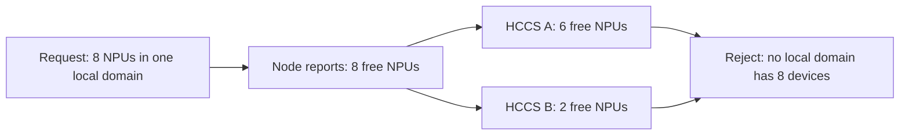
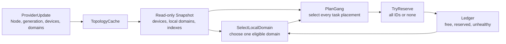
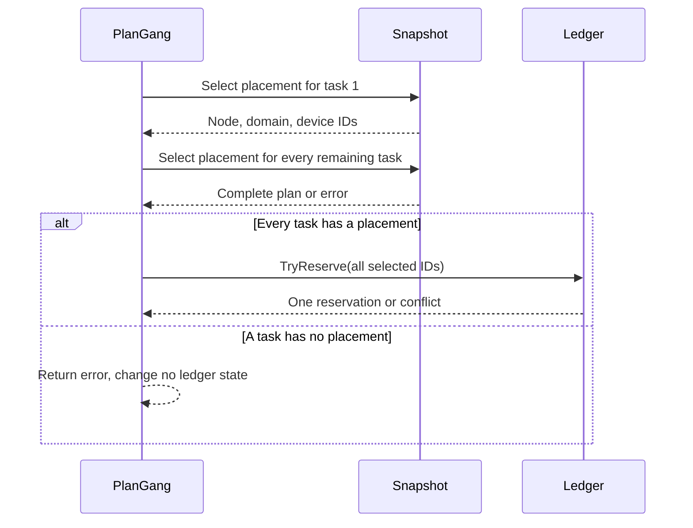

# xPU Local-Domain POC

This package is a narrow proof of concept for [issue #5751](https://github.com/volcano-sh/volcano/issues/5751), Support Generic xPU Topology-Aware Scheduling.

It demonstrates the scheduler-side logic needed to place accelerator workloads in one valid local device domain. It is not registered as a Volcano scheduler plugin. It does not add a workload API, informer, DRA integration, DeviceShare integration, or Gang framework extension.

## What Problem It Proves

A Node-level device count does not show whether devices belong to one connected domain.

For example, a Node has eight free NPUs, but they are split across two independent HCCS domains. An eight-NPU workload that requires one connected domain must not be placed on that Node.



The POC checks each local domain separately. It does not treat the total number of devices on a Node as proof that one connected device group exists.

## POC Flow

The POC separates provider facts, read-only topology, and changing reservation state.



1. `TopologyCache.Apply` accepts a Node update only when its generation is newer than the stored generation.
2. The cache validates the update and creates a new `Snapshot`.
3. `SelectLocalDomain` looks for enough healthy and free devices inside one domain.
4. `PlanGang` finds a placement for every requested task before changing the ledger.
5. `TryReserve` reserves every selected device ID together or leaves all IDs unchanged.

## Main Types

| Type | Purpose in this POC |
| --- | --- |
| `Device` | One physical accelerator with an ID, resource name, Node, local-domain ID, and health state. |
| `LocalDomain` | One Node-local connected device group and its member device IDs. |
| `Snapshot` | A validated, read-only view of devices and local domains. It indexes local domains by Node and resource name. |
| `TopologyCache` | Stores the latest snapshot and rejects stale provider updates for a Node. |
| `Ledger` | Stores changing device availability. A device is free, reserved, allocated, or unhealthy. |
| `Placement` | The selected Node, local domain, and concrete device IDs for one task. |
| `GangPlan` | Every task placement and the single reservation that covers all selected IDs. |

The `Snapshot` answers, “Which domains and devices exist?” The `Ledger` answers, “Which of those devices are safe to select now?”

## Local-Domain Selection

`SelectLocalDomain` receives a Node, resource name, and requested device count. It checks local domains in sorted ID order. Within an eligible domain, it sorts device IDs before choosing them.

This gives two useful properties:

- A fragmented Node fails when no one domain has enough healthy and free devices.
- The same input produces the same selected device IDs.

The HAMi-shaped test uses ten Ascend910 devices split into two independent five-device `NetworkID` groups. An eight-device request fails even though the Node has ten devices in total. The POC receives generic local-domain facts. It does not depend on HAMi fields or vendor-specific selection logic.

## Gang Planning and Atomic Reservation

The POC plans the whole Gang before it reserves a device.



`PlanGang` prevents one task from using device IDs that another task in the same plan already selected. If any task has no valid local-domain placement, it returns `ErrGangPlanIncomplete` before reserving any ID.

`TryReserve` holds a mutex while it checks the complete request. It rejects duplicate IDs, an existing reservation ID, and every device that is not free. On failure, it does not reserve the earlier IDs from the request.

```text
selected IDs: [device-1, device-2]

device-1 free, device-2 free        -> reserve both
device-1 free, device-2 reserved    -> reserve neither
```

`Release` returns devices from one reservation to the free state. It leaves an allocated or unhealthy device unchanged.

## Test Coverage

| Test | Behaviour covered |
| --- | --- |
| `TestSelectLocalDomainRejectsFragmentedCapacity` | Rejects six-plus-two capacity for an eight-device request. |
| `TestSelectLocalDomainRejectsHAMiShapedNetworkIDFragmentation` | Maps a legacy HAMi-shaped five-plus-five `NetworkID` layout into generic local domains and rejects an eight-device request. |
| `TestSelectLocalDomainSelectsDeterministicDeviceIDs` | Selects sorted IDs from one eligible domain. |
| `TestTryReserveIsAtomic` | A conflict leaves unrelated free IDs unchanged. |
| `TestReleaseMakesDevicesAvailableAgain` | Releasing a reservation returns reserved devices to free state. |
| `TestNewSnapshotRejectsUnknownDomainMember` | Rejects invalid device-to-domain membership. |
| `TestTopologyCacheUpdatesOnlyAffectedNode` | Accepts a newer Node generation, preserves other Node facts, and rejects a stale update. |
| `TestPlanGangReservesEveryTaskOrNothing` | Reserves all task IDs for a complete Gang plan and leaves the ledger unchanged for an incomplete plan. |

Run the focused tests:

```bash
go test ./pkg/scheduler/plugins/xputopology
```

## What This POC Does Not Do

This POC deliberately does not:

- register a production scheduler plugin or workload API
- watch Kubernetes Nodes, topology CRDs, Device Plugins, or DRA ResourceSlices
- allocate a device through kubelet, DeviceShare, or a DRA driver
- create cross-Node fabric domains
- schedule fractional devices such as vGPU, vNPU, or MIG slices
- change normal `NodeInfo` resource accounting
- change existing DeviceShare or DRA behaviour
- add a Gang framework hook or bind Pods

The next production step needs maintainer agreement on the workload API, provider contract, exact-allocation adapter contract, and transaction integration. The POC is evidence for the local-domain planning and atomic-reservation rules. It is not a competing device allocator.
